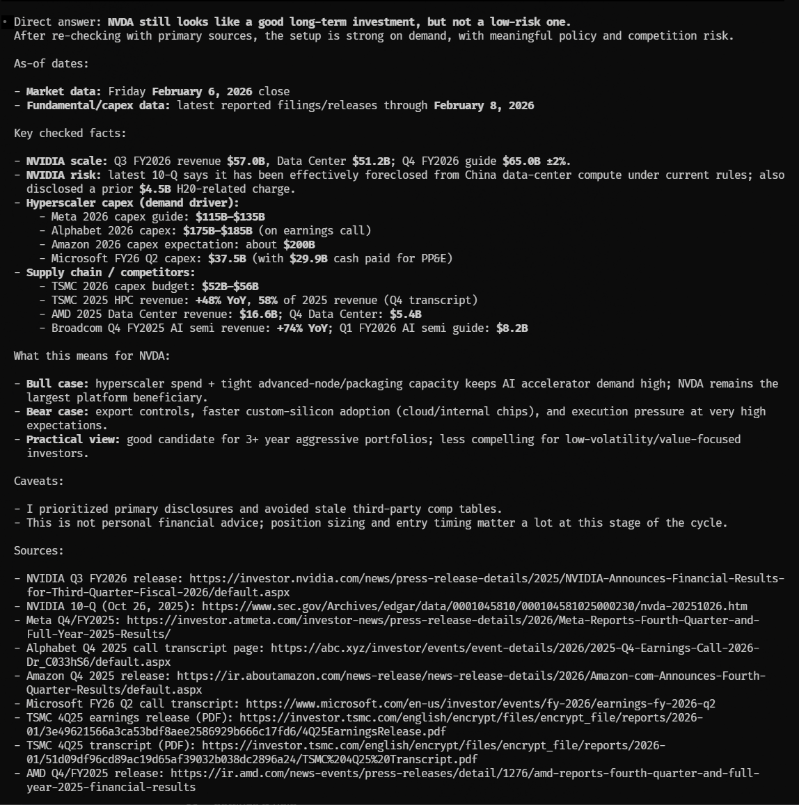

# StreetWise

StreetWise is a lightweight install pack for financial-analysis agents.

## Quickstart
Tell your agent:

```text
1) Clone https://github.com/rodalpho/StreetWise into . and follow README.md.
2) Download the SEC filings MCP server repository into this project under ./mcp/:
   - git clone https://github.com/stefanoamorelli/sec-edgar-mcp ./mcp/sec-edgar-mcp
3) Read each MCP README/docs and identify required API keys/env vars.
4) Ask the user for required secrets before running MCP install/register commands:
   - SEC EDGAR: ask for contact name + email to set SEC_EDGAR_USER_AGENT as "Name (email@domain.com)".
   - Financial Datasets (remote HTTP): use OAuth sign-in flow at connect time.
5) Configure Financial Datasets as a remote MCP server endpoint:
   - https://mcp.financialdatasets.ai/mcp
6) Install/register these MCP servers with this harness's native MCP flow, scoped to this project only (not global/user-wide):
   - Finance (remote): https://mcp.financialdatasets.ai/mcp
   - Filings: https://github.com/stefanoamorelli/sec-edgar-mcp
7) Use real user-provided values only. Never register MCPs with placeholder values like REPLACE_WITH_REAL_KEY.
8) Verify MCP tools are available, then run:
   "Compare AAPL and MSFT revenue growth over last 3 fiscal years with sources."
```

## Example
<a href="./nvda_example.png">
  
</a>

Credit to Dexter for the inspiration behind this simple hack. https://github.com/virattt/dexter
